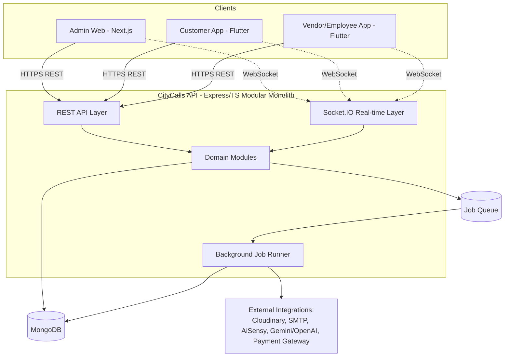

# 08 — System Architecture

## 1. Architecture Style: Modular Monolith

CityCalls backend is **one deployable Node.js/Express/TypeScript service**, internally organized into isolated domain modules — not a microservices split. Rationale:

- Two-developer team; microservices multiply deployment/ops overhead without a scaling need at this stage.
- Core flows (a Service Request touches Customer, Product, Call, Vendor, Notification, Finance modules in one logical operation) are heavily cross-referenced — a monolith keeps these transactionally simple; microservices would force distributed-transaction or eventual-consistency handling for no current benefit.
- Modules are still built with hard internal boundaries (own folder, own models, own service layer, communicate through defined internal service functions, not direct cross-module DB queries) so a future split is a refactor, not a rewrite.

## 2. Domain Modules (folder = ownership boundary)

Within the standalone `citycalls-api` repo, `src/modules/`: `auth`, `users`, `organization` (branch/sub-branch/team), `employees`, `vendors`, `customers`, `catalog` (services/brands/products/masters), `config` (masters engine, policies, numbering), `calls`, `leads`, `service-requests`, `field-execution`, `reopen`, `finance` (estimates/proforma/invoices/payments), `notifications`, `marketing` (whatsapp/email campaigns), `ai`, `files`, `reports`, `audit`, `import-export`.

Each module exposes a narrow internal API (`module.service.ts` exported functions) for other modules to call — e.g. `finance` module calls `customers.service.getCustomerBillingInfo()` rather than querying the `customers` collection directly. This is enforced by code review, not a build-time boundary, for v1.

## 3. Request Flow (typical)

1. Client → REST endpoint (JWT-authenticated) → route → validation middleware (Zod schema, matching [10-api-standards.md](10-api-standards.md)) → controller → module service function.
2. Service function performs the business operation, writes to MongoDB, and — for anything with side effects (notification, audit log) — **enqueues a job** rather than performing it inline, so a slow/failing integration never extends the client's request latency or causes a rollback of the core state change.
3. Background Job Runner (in-process queue for v1, see §6) picks up jobs: send notification, generate PDF, sync WhatsApp template, run AI summarization, etc.
4. Real-time layer (Socket.IO) pushes state-change events to subscribed clients (e.g., admin dashboard subscribed to a Branch's request feed, customer app subscribed to its own Service Request, technician's live location subscribed to by the assigning admin).

## 4. Real-Time Layer

Required from day one per project decision. Socket.IO server co-located with the API process (same deployable unit, not a separate service, for v1).

- **Rooms** scoped by entity: `service-request:{id}`, `branch:{id}:dashboard`, `user:{id}:notifications`.
- **Events emitted**: `service-request.status-changed`, `service-request.assigned`, `technician.location-updated`, `notification.new`.
- **Technician location updates**: event-based pings (on status-change actions: start travel, arrival) plus an optional periodic ping while `TECHNICIAN_EN_ROUTE` (interval configurable, default every 60s) — not a continuous GPS trail, to manage battery and privacy (flagged as a default in [21-open-decisions-and-clarifications.md](21-open-decisions-and-clarifications.md), confirm before building).
- Socket auth via the same JWT used for REST, validated on connection and on room-join.

## 5. Offline-First Field App (Vendor/Employee)

The Flutter vendor/employee app is architected offline-first for the execution flow (Stage 5–8 of [06-complete-workflow-document.md](06-complete-workflow-document.md)):

- Local persistence (SQLite/Drift or Hive) mirrors the subset of Service Request data assigned to that technician.
- Actions (status changes, diagnosis, parts, images, completion) write locally first with a `pendingSync` flag and a client-generated idempotency key, then a background sync process pushes to the API when connectivity is available.
- Image/video uploads queue locally and upload opportunistically; the API accepts them independent of the status-change event they're attached to, then links them once uploaded.
- Conflict rule: **last-write-wins is not acceptable for status** — the server is the source of truth for the *current* status; a queued client status-change that's no longer a valid transition from the server's current status (per [07-status-transition-matrix.md](07-status-transition-matrix.md)) is rejected with a clear conflict response, and the app surfaces this to the technician rather than silently dropping or forcing it.

## 6. Background Jobs

For v1: an in-process job queue (e.g. `bullmq` backed by Redis, or a simpler Mongo-backed queue if Redis is not desired for hosting-simplicity reasons — decide in [manish/12-background-jobs-and-notifications.md](manish/12-background-jobs-and-notifications.md)). Handles: notification dispatch, PDF generation, scheduled tasks (SLA-breach checks, happy-call scheduling, follow-up reminders, document-expiry alerts, holiday-aware SLA timers), campaign sends, AI requests.

## 7. Integration Abstraction

Every optional integration (Cloudinary, SMTP, AiSensy, Gemini/OpenAI, Payment Gateway, SMS) sits behind an internal interface in `modules/files`, `modules/notifications`, `modules/marketing`, `modules/ai` respectively, with an enabled/disabled config flag checked before every call. Disabled or failing integrations degrade per [14-integration-architecture.md](14-integration-architecture.md) — core workflow state changes never depend on their success.

## 8. Environments

Local (Docker Compose: API + MongoDB + Redis) → Staging → Production. Deployment target left cloud-agnostic per [20-deployment-and-environments.md](20-deployment-and-environments.md) (decision pending).

## 9. Why OpenAPI/JSON Schema as the Contract Spine

CityCalls is five independent repositories with **no shared code package** between any of them (confirmed decision, [manish/01-project-and-repository-setup.md](manish/01-project-and-repository-setup.md) §2) — admin-web is TypeScript and both mobile apps are Flutter/Dart, and even within the TS side nothing is shared as an importable package. The OpenAPI spec, held canonically in the `citycalls-docs` repo, is therefore the *only* thing that can keep four independently-built clients/backend consistent. Each repo pulls its own local copy of the spec (`scripts/sync-contracts.sh`, per [manish/01-project-and-repository-setup.md](manish/01-project-and-repository-setup.md) §3) and generates its own local API client and types from it — `citycalls-admin-web`'s TS client, `citycalls-customer-mobile`'s Dart client, and `citycalls-vendor-mobile`'s independently-generated Dart client (not shared with the customer app) are three separate generated artifacts from the same source spec, not three consumers of one shared package. The API's own request validation (Zod, server-side in `citycalls-api`) is the actual source of truth enforced at runtime — the OpenAPI spec is documentation-and-codegen, not a runtime gate itself.

## 10. Security Posture (summary — full detail in [17-security-and-audit.md](17-security-and-audit.md))

JWT access + refresh tokens, role + data-scope authorization on every endpoint, secrets in environment variables (never committed), rate limiting on public/customer-facing and OTP endpoints, signed/short-lived URLs for Cloudinary uploads, audit log on every sensitive action.
