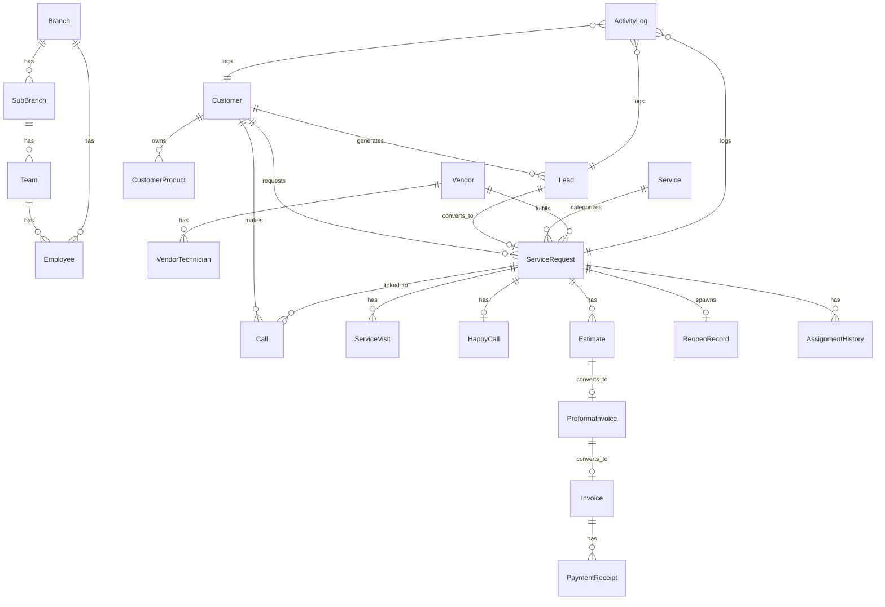

# 09 — Database Architecture

MongoDB + Mongoose. Naming per [coordination/06-naming-conventions.md](coordination/06-naming-conventions.md). This document defines collections, key fields, relationships, and the three engines (Config/Masters, Numbering, Policy Resolution) that keep the platform dynamic per the project's core constraint: **nothing important is hardcoded**.

## 1. Entity Relationship Overview



## 2. Core Collections (key fields only — full field lists live in [11-complete-api-contracts.md](11-complete-api-contracts.md) per endpoint)

### `users`
`_id, name, email, mobile, passwordHash, role (enum), status (ACTIVE|INACTIVE), branchId?, subBranchId?, teamId?, vendorId?, lastLoginAt, createdAt, updatedAt`
One collection for all authenticated actors (staff, vendor users, customers) — role determines behavior, not a separate collection, so auth/session logic stays uniform. Customer-specific fields live on `customers`, FK'd via `userId`.

### `branches` / `sub_branches` / `teams`
Hierarchy per [coordination/06-naming-conventions.md](coordination/06-naming-conventions.md) §2. `branches`: `name, code, coverage: {pinCodes[], cities[], states[]}, serviceCategoryIds[], workingHours, holidays[], managerId, active`. `sub_branches`: `branchId` FK + same shape. `teams`: `subBranchId` or `branchId` FK, `name`, `leadId`, `memberIds[]`.

### `employees`
`userId` FK, `branchId, subBranchId?, teamId?, skills[], certifications[], documents[], availability, dailyCapacity, active`

### `vendors`
`companyName, contactPersons[], serviceAreas: {pinCodes[]}, servicesOffered[], brandsHandled[], productTypesHandled[], skills[], gst, pan, bankDetails, agreement: {url, expiryDate}, commissionModel, active, blacklisted, blacklistReason?`

### `vendor_technicians`
`userId` FK, `vendorId` FK, `skills[]`, `active`

### `customers`
`userId?` FK (null until first app login/registration), `customerType (INDIVIDUAL|BUSINESS)`, `name, businessName?, gstin?, contacts: [{name, mobile, isPrimary}], addresses: [{label, line1, line2, landmark, city, state, pinCode, country, isDefault, geo?}], tags[], segments[], notes[], consent: {whatsapp: ConsentState, email: ConsentState, sms: ConsentState, updatedAt per channel}, blacklisted, duplicateOfCustomerId?`
Addresses and contacts are **embedded arrays**, not separate collections — they're always accessed in the context of their parent customer and don't need independent querying/history at v1 scope.

### `customer_products`
`customerId` FK, `brandId, productTypeId, modelNumber?, serialNumber?, purchaseDate?, warrantyExpiresAt?, notes`
Kept as its own collection (not embedded) because it's referenced independently by many `Call`/`ServiceRequest` documents and can accumulate its own service history.

### `services` (dynamic catalog)
`name, categoryId, subCategoryId?, applicableBrandIds[], applicableProductTypeIds[], complaintTypeIds[], symptomIds[], defectIds[], solutionTypeIds[], requiredSkills[], expectedDurationMinutes, pricing: {basePrice, visitingCharge, inspectionCharge, emergencyCharge}, taxRateId, warrantyPeriodDays, reopenPeriodDaysOverride?, requiredDocuments[], requiredImages: {before: number, after: number}, mandatoryChecklist[], customFields[], slaMinutes, assignmentRuleSetId?, cancellationPolicyId, reschedulePolicyId, notificationTemplateSetId, statusWorkflowVariantId?, active`

### `calls`
`callType (enum, see naming doc)`, `direction`, `customerId?` (nullable — a call may precede customer identification), `customerProductId?`, `relatedLeadId?`, `relatedServiceRequestId?`, `callerNumber, alternateNumber, callDate, callTime, source, priority, notes, attachments[], recordingUrl?, createdBy, assignedTo?, outcome?`
Plus sub-type-specific fields per [03-screenshot-and-excel-analysis.md](03-screenshot-and-excel-analysis.md) stored in a `details: {}` sub-document keyed by `callType` (e.g. `details.requirementCall.warrantyStatus`) rather than one flat schema with every possible field — keeps the document lean per call type while remaining one collection for easy timeline queries.

### `leads`
`stage (enum), source, priority, score?, ownerId, customerId? (or inline contact info before conversion), productInterest, requirement, followUpDate?, notes[], attachments[], taskIds[], lostReason?, duplicateOfLeadId?, convertedToCustomerId?, convertedToServiceRequestId?, campaignId?`

### `service_requests`
`number (generated), customerId, customerProductId, addressSnapshot (copied at creation time, not live-referenced, so later address edits don't rewrite history), serviceId, branchId?, subBranchId?, assigneeType?, assigneeId?, status, isEscalated, escalationReason?, priority, source, relatedCallId?, relatedLeadId?, symptoms[], scheduledDate?, scheduledSlot?, isReopen, originalServiceRequestId?, sla: {dueAt, breachedAt?}, createdAt, updatedAt`
Status is the single current-state field; **all history lives in `assignment_history` and `activity_logs`, never as an array on this document**, to keep it small and avoid unbounded array growth.

### `service_visits`
`serviceRequestId` FK, `visitNumber, technicianId, startedAt?, arrivedAt?, inspection: {defectFound, symptoms[], solutionType}, parts: [{partId, name, qty, unitPrice}], labourCharge, beforeImages[], afterImages[], workNotes, completedAt?, completionProof: {type: OTP|SIGNATURE|APP_CONFIRMATION, value/url}, nextVisitDate?`

### `happy_calls`
`serviceRequestId` FK, `assignedTo, performedBy, callDate, callTime, status, outcome, customerSatisfaction, remarks, reopenRequested, escalationRequired, nextFollowUpDate?, recordingUrl?`

### `reopen_records`
`originalServiceRequestId, newServiceRequestId, reason, reopenedBy, reopenedAt, withinPolicyWindow (bool), warrantyApplied (bool), reopenCount (denormalized counter on the *original* SR's product/customer line for fast reporting)`

### `assignment_history`
`serviceRequestId` FK, `fromAssigneeType?, fromAssigneeId?, toAssigneeType, toAssigneeId, action (ASSIGNED|REASSIGNED|ACCEPTED|REJECTED|ESCALATED), reason?, actorId, actorRole, method (MANUAL|RULE_ENGINE|BYPASS), timestamp`

### `estimates` / `proforma_invoices` / `invoices` / `payment_receipts` / `credit_notes` / `debit_notes`
Shared shape: `number, serviceRequestId?, leadId?, customerId, branchId, financialYear, items: [{description, partId?, qty, unitPrice, taxRateId}], subtotal, taxBreakup: {cgst, sgst, igst}, discount, roundOff, total, status, pdfUrl?, sentVia[], revisionOf?, cancelledAt?, cancelReason?, approvedBy?, approvedAt?`. Full doc-type-specific fields in [16-pdf-and-financial-documents.md](16-pdf-and-financial-documents.md).

### `vendor_invoices` / `vendor_payouts`
`vendorId, period/serviceRequestIds[], amount, commissionBreakup, status, paidAt?`

### `activity_logs`
`entityType, entityId, userId, userRole, action, module, oldValue?, newValue?, ipAddress, device, sourceApp, reason?, timestamp` — generic, indexed on `{entityType, entityId, timestamp}` for fast per-record timeline queries.

### `notifications` / `notification_templates`
`notification_templates`: `triggerKey, channel, subjectTemplate?, bodyTemplate, variables[], active`. `notifications`: `templateId, recipientUserId, channel, payload, status (PENDING|SENT|DELIVERED|READ|FAILED), retryCount, sentAt?, failureReason?`.

### `campaigns`
`channel (WHATSAPP|EMAIL), templateId, audienceFilter, scheduledAt?, status, stats: {sent, delivered, read, failed}`

### Masters (Config/Masters engine — see §3)
`service_categories, brands, product_types, symptoms, defects, solutions, parts, units, tax_rates, priorities, lead_sources, call_types, appointment_slots, payment_methods`

### `numbering_series` and `policies` — see §4 and §5

### `contracts` *(reserved, P3)*
`customerId, type, coverage: {productIds[], serviceIds[]}, validity: {start, end}, visitLimits: {free, paid}, includedParts[], excludedParts[], status` — schema stub present now so `service_requests.contractId?` can be added later without a breaking migration; not used until AMC phase.

## 3. Config/Masters Engine

Every master collection shares a common shape so the admin UI (Rohit) can render a **generic master-management screen** rather than one bespoke screen per list:

```
{
  _id,
  key: string,          // stable code, e.g. "AC_REPAIR", never shown to end users
  label: string,        // display name, editable
  parentId?: ObjectId,  // for hierarchical masters (category > subcategory)
  meta: {},             // type-specific extra fields
  sortOrder: number,
  active: boolean,
  createdAt, updatedAt
}
```

Adding a new master type (e.g. "Solution Types") is a matter of registering a new `masterType` key against this shared schema + collection, not writing a new model. See [manish/03-database-model-implementation-plan.md](manish/03-database-model-implementation-plan.md) for the registry pattern.

## 4. Numbering Engine

```
numbering_series: {
  documentType: enum,     // SERVICE_REQUEST, LEAD, ESTIMATE, INVOICE, ...
  branchId?: ObjectId,    // null = org-wide series (e.g. Customer, Vendor)
  financialYear?: string, // null if not FY-scoped
  prefix: string,
  padLength: number,      // e.g. 6 -> 000482
  lastSequence: number
}
```

`getNextNumber(documentType, branchId, financialYear)` atomically increments `lastSequence` (Mongo `findOneAndUpdate` with `$inc`, upsert) and formats per [coordination/06-naming-conventions.md](coordination/06-naming-conventions.md) §3. Reset behavior (per-FY vs. never) is a flag on the series document, admin-editable.

## 5. Policy Resolution Engine (reopen / warranty / cancellation / reschedule)

```
policies: {
  policyType: enum,       // REOPEN, WARRANTY, CANCELLATION, RESCHEDULE
  scope: enum,            // GLOBAL, BRANCH, SERVICE, PRODUCT, BRAND, CONTRACT, CUSTOMER
  scopeRefId?: ObjectId,  // null for GLOBAL
  rules: {}                // e.g. { windowDays: 90 } for REOPEN
}
```

**Resolution order (most specific wins)**: `CUSTOMER` > `CONTRACT` > `BRAND` > `PRODUCT` > `SERVICE` > `BRANCH` > `GLOBAL`. Lookup checks each scope in that order for a matching policy of the requested `policyType`; first match wins; if none match at any level, the hardcoded platform default (90 days for `REOPEN`) applies as the absolute fallback — this one default is the only place the number "90" may appear in code, purely as a bootstrap value, and it's overridden by seeding a `GLOBAL` policy row on setup.

## 6. Indexing Notes (non-exhaustive, detailed per-endpoint in [11-complete-api-contracts.md](11-complete-api-contracts.md))

- `service_requests`: compound index on `{branchId, status}`, `{assigneeType, assigneeId, status}`, `{customerId}`, text index on `number`.
- `activity_logs`: compound `{entityType, entityId, timestamp}`.
- `customers`: index on `contacts.mobile`, `addresses.pinCode`, text index for name search.
- `calls`: `{customerId, callDate}`, `{relatedServiceRequestId}`.

## 7. Why History Lives in Separate Collections, Not Embedded Arrays

`assignment_history`, `activity_logs`, and `reopen_records` are separate collections rather than arrays embedded on `service_requests` because: (a) MongoDB documents have a 16MB cap and high-activity requests could theoretically approach array-growth limits over a long lifetime, (b) history needs independent indexing/querying (e.g. "all reassignments by this manager this month" across requests), and (c) it matches the explicit project requirement that "every assignment, reassignment, rejection and escalation must maintain complete history" as first-class, queryable data — not a side effect of a mutable document.
